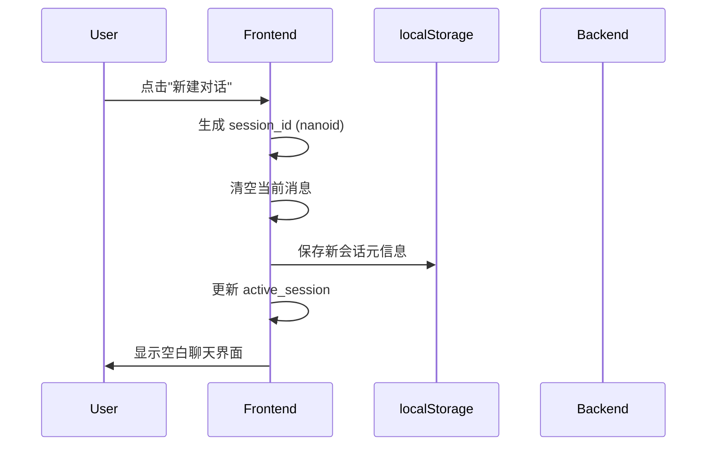
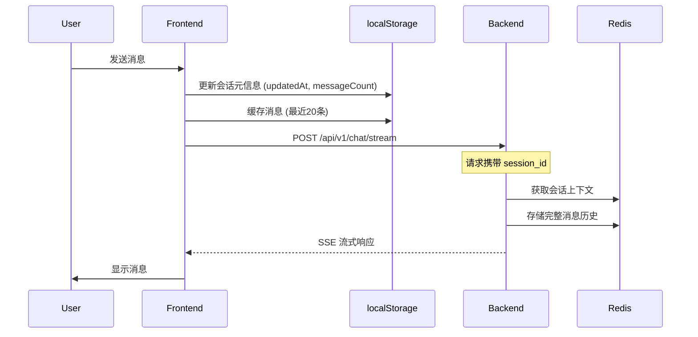
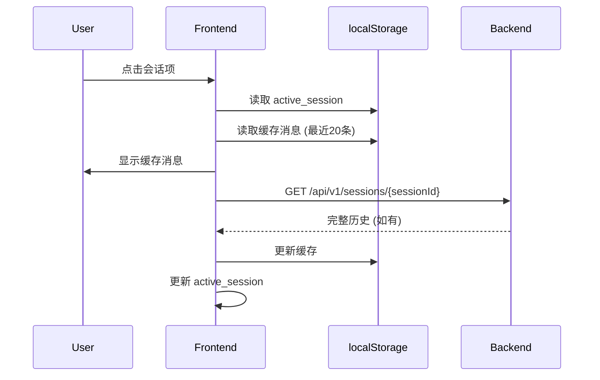

# 前端会话记忆系统设计文档

**日期:** 2026-06-01
**状态:** 设计评审
**目标:** 为 I3D Agent System 前端添加完整的会话管理功能，实现多会话隔离、持久化存储和记忆集成。

---

## 1. 概述

### 1.1 背景

当前前端是单会话模式，刷新页面后对话历史丢失。后端已有完整的记忆系统（基于 Redis），支持通过 `session_id` 进行会话隔离。本设计旨在为前端添加多会话管理能力。

### 1.2 设计目标

1. **多会话管理** - 支持创建、切换、删除多个会话
2. **会话持久化** - 使用 localStorage 持久化所有会话
3. **会话隔离** - 每个会话通过 `session_id` (Nanoid) 实现完全隔离
4. **记忆集成** - 与后端记忆系统无缝对接
5. **UI 优化** - 类似 ChatGPT 的侧边栏会话列表

---

## 2. 技术方案

### 2.1 Session ID 生成

**方案:** Nanoid

```javascript
import { nanoid } from 'nanoid'

// 生成 21 字符的唯一 ID
const sessionId = nanoid() // 例: "V1StGXR8_Z5jdHi6B-myL"
```

**选择理由:**
- 比 UUID v4 短（21 vs 36 字符）
- URL 安全字符
- 碰撞概率极低
- 前端可直接生成

### 2.2 存储架构

#### 2.2.1 前端存储 (localStorage)

```javascript
// 会话元数据列表
localStorage.setItem('i3d_sessions', JSON.stringify([
  {
    sessionId: 'V1StGXR8_Z5jdHi6B',
    title: '搜索螺栓零件',
    createdAt: 1717234567890,
    updatedAt: 1717234590123,
    agentType: 'search',
    messageCount: 5,
    isPinned: false
  },
  // ...
]))

// 当前激活会话 ID
localStorage.setItem('i3d_active_session', 'V1StGXR8_Z5jdHi6B')
```

#### 2.2.2 消息存储策略（混合模式）

| 存储位置 | 内容 | 数量限制 | 用途 |
|---------|------|---------|------|
| **前端 localStorage** | 最近 20 条消息 | 每会话 20 条 | 快速显示、离线查看 |
| **后端 Redis** | 完整对话历史 | 无限制 | 完整历史、跨同步 |

```javascript
// 前端缓存结构
localStorage.setItem(`i3d_messages_${sessionId}`, JSON.stringify([
  { id: 1, role: 'user', content: '...', timestamp: ... },
  { id: 2, role: 'assistant', content: '...', timestamp: ... },
  // ... 最近 20 条
]))
```

#### 2.2.3 后端存储集成

后端通过 `session_id` 作为 Redis key 存储完整历史：

```
memory:context:{user_id}:{session_id} → 会话上下文
memory:conversation:{session_id} → 完整消息历史
```

### 2.3 长期记忆存储

#### 2.2.1 存储内容（当前实现）

| 类型 | 内容 | 存储位置 |
|-----|------|---------|
| **用户偏好** | 租户、默认 Agent、主题 | localStorage + Redis |
| **重要对话** | 用户收藏的对话片段 | Redis (24h TTL) |
| **搜索历史** | 最近搜索查询 | Redis (24h TTL) |

```javascript
// 用户偏好示例
localStorage.setItem('i3d_preferences', JSON.stringify({
  defaultTenant: 'huabei',
  defaultAgent: 'general',
  theme: 'dark',
  pinnedSessions: ['sessionId1', 'sessionId2']
}))
```

#### 2.2.2 后续迭代（待实现）

| 功能 | 描述 | 优先级 |
|-----|------|--------|
| **对话摘要** | 对每个会话生成 AI 摘要，用于语义检索 | P1 |
| **知识图谱** | 提取实体关系，构建用户专属知识库 | P2 |

---

## 3. UI/UX 设计

### 3.1 布局调整

#### 原布局
```
┌──────────────────────────────────────┐
│  Sidebar              │  Chat Area     │
│  ├─ Agent Selection  │                │
│  ├─ Tenant Select    │  Messages      │
│  └─ User ID          │  Input         │
└──────────────────────────────────────┘
```

#### 新布局
```
┌──────────────────────────────────────┐
│  Session Sidebar       │  Chat Area   │
│  ├─ New Chat Button   │  ├─ Agent    │
│  ├─ Session List       │  │  Selector  │
│  │  ├─ Session 1       │  ├─ Messages │
│  │  ├─ Session 2       │  └─ Input    │
│  │  └─ ...            │               │
│  └─ Settings (折叠)    │               │
└──────────────────────────────────────┘
```

### 3.2 侧边栏组件

```vue
<SessionSidebar>
  <!-- 顶部：新建按钮 -->
  <NewChatButton @click="createNewSession" />

  <!-- 会话列表 -->
  <SessionList>
    <SessionItem
      v-for="session in sessions"
      :key="session.sessionId"
      :session="session"
      :active="session.sessionId === activeSessionId"
      @click="switchSession"
      @contextmenu="showContextMenu"
    >
      <SessionIcon :agentType="session.agentType" />
      <SessionTitle>{{ session.title }}</SessionTitle>
      <SessionActions>
        <PinButton v-if="!session.isPinned" @click.stop="pinSession" />
        <DeleteButton @click.stop="deleteSession" />
      </SessionActions>
    </SessionItem>
  </SessionList>

  <!-- 底部：设置折叠区 -->
  <SettingsToggle>
    <TenantSelect />
    <UserIdInput />
  </SettingsToggle>
</SessionSidebar>
```

### 3.3 会话项交互

| 操作 | 触发方式 | 行为 |
|-----|---------|------|
| **切换会话** | 左键点击 | 加载会话消息，设置为活跃会话 |
| **重命名** | 右键菜单 → 重命名 | 弹出输入框，更新标题 |
| **固定** | 点击固定图标 | 会话置顶，跨页保持 |
| **删除** | 右键菜单 → 删除 | 二次确认后删除会话 |
| **导出** | 右键菜单 → 导出 | 下载为 Markdown/JSON |

### 3.4 Agent 选择器

位置：聊天区域顶部

```vue
<AgentSelector>
  <DropdownButton>
    <AgentIcon :type="currentAgent" />
    {{ agentConfig.title }}
    <DropdownArrow />
  </DropdownButton>
  <DropdownMenu>
    <AgentOption
      v-for="(config, key) in AGENTS"
      :key="key"
      :selected="key === currentAgent"
      @click="switchAgent(key)"
    >
      <AgentIcon :type="key" />
      {{ config.title }}
      <Badge>{{ config.badge }}</Badge>
    </AgentOption>
  </DropdownMenu>
</AgentSelector>
```

---

## 4. 数据流设计

### 4.1 会话创建流程



### 4.2 消息发送流程（含记忆集成）



### 4.3 会话切换流程



---

## 5. Composables 设计

### 5.1 useSessions（会话管理）

```javascript
// src/composables/useSessions.js
import { ref, computed } from 'vue'
import { nanoid } from 'nanoid'

const SESSIONS_KEY = 'i3d_sessions'
const ACTIVE_SESSION_KEY = 'i3d_active_session'
const MAX_CACHED_MESSAGES = 20

export function useSessions() {
  const sessions = ref([])
  const activeSessionId = ref(null)

  // 初始化：从 localStorage 加载
  function loadSessions() {
    const stored = localStorage.getItem(SESSIONS_KEY)
    sessions.value = stored ? JSON.parse(stored) : []
    activeSessionId.value = localStorage.getItem(ACTIVE_SESSION_KEY)
  }

  // 保存到 localStorage
  function saveSessions() {
    localStorage.setItem(SESSIONS_KEY, JSON.stringify(sessions.value))
  }

  // 创建新会话
  function createSession(agentType = 'general') {
    const sessionId = nanoid()
    const newSession = {
      sessionId,
      title: '新对话',
      createdAt: Date.now(),
      updatedAt: Date.now(),
      agentType,
      messageCount: 0,
      isPinned: false
    }

    sessions.value.unshift(newSession)
    activeSessionId.value = sessionId
    saveSessions()
    localStorage.setItem(ACTIVE_SESSION_KEY, sessionId)

    return sessionId
  }

  // 切换会话
  function switchSession(sessionId) {
    if (sessionId !== activeSessionId.value) {
      activeSessionId.value = sessionId
      localStorage.setItem(ACTIVE_SESSION_KEY, sessionId)
      return true
    }
    return false
  }

  // 删除会话
  function deleteSession(sessionId) {
    const index = sessions.value.findIndex(s => s.sessionId === sessionId)
    if (index !== -1) {
      sessions.value.splice(index, 1)

      // 清除消息缓存
      localStorage.removeItem(`i3d_messages_${sessionId}`)

      // 如果删除的是当前会话，切换到第一个或创建新会话
      if (sessionId === activeSessionId.value) {
        if (sessions.value.length > 0) {
          activeSessionId.value = sessions.value[0].sessionId
        } else {
          createSession()
        }
        localStorage.setItem(ACTIVE_SESSION_KEY, activeSessionId.value)
      }

      saveSessions()
    }
  }

  // 重命名会话
  function renameSession(sessionId, newTitle) {
    const session = sessions.value.find(s => s.sessionId === sessionId)
    if (session) {
      session.title = newTitle
      saveSessions()
    }
  }

  // 固定/取消固定会话
  function togglePinSession(sessionId) {
    const session = sessions.value.find(s => s.sessionId === sessionId)
    if (session) {
      session.isPinned = !session.isPinned
      // 重新排序：固定的在前
      sessions.value.sort((a, b) => {
        if (a.isPinned && !b.isPinned) return -1
        if (!a.isPinned && b.isPinned) return 1
        return b.updatedAt - a.updatedAt
      })
      saveSessions()
    }
  }

  // 更新会话元信息（用于发送消息后）
  function updateSessionMeta(sessionId, updates) {
    const session = sessions.value.find(s => s.sessionId === sessionId)
    if (session) {
      Object.assign(session, updates)
      session.updatedAt = Date.now()
      saveSessions()
    }
  }

  // 排序后的会话列表
  const sortedSessions = computed(() => {
    return [...sessions.value].sort((a, b) => {
      if (a.isPinned && !b.isPinned) return -1
      if (!a.isPinned && b.isPinned) return 1
      return b.updatedAt - a.updatedAt
    })
  })

  // 获取当前会话
  const currentSession = computed(() => {
    return sessions.value.find(s => s.sessionId === activeSessionId.value)
  })

  return {
    sessions: sortedSessions,
    activeSessionId,
    currentSession,
    loadSessions,
    createSession,
    switchSession,
    deleteSession,
    renameSession,
    togglePinSession,
    updateSessionMeta
  }
}
```

### 5.2 useMessages（消息管理，含混合模式）

```javascript
// src/composables/useMessages.js
import { ref, watch } from 'vue'
import { sendChatMessage, streamChatMessage } from '../utils/api.js'

const MESSAGES_KEY_PREFIX = 'i3d_messages_'
const MAX_CACHED_MESSAGES = 20

export function useMessages(sessionId) {
  const messages = ref([])
  const isTyping = ref(false)

  // 从 localStorage 加载缓存的消息
  function loadCachedMessages() {
    const key = `${MESSAGES_KEY_PREFIX}${sessionId.value}`
    const cached = localStorage.getItem(key)
    messages.value = cached ? JSON.parse(cached) : []
  }

  // 保存消息到缓存（只保留最近20条）
  function saveCachedMessages() {
    const key = `${MESSAGES_KEY_PREFIX}${sessionId.value}`
    const toCache = messages.value.slice(-MAX_CACHED_MESSAGES)
    localStorage.setItem(key, JSON.stringify(toCache))
  }

  // 监听 sessionId 变化，自动加载缓存
  watch(sessionId, (newId) => {
    if (newId) {
      loadCachedMessages()
    }
  }, { immediate: true })

  // 监听 messages 变化，自动保存缓存
  watch(messages, () => {
    saveCachedMessages()
  }, { deep: true })

  // 添加消息
  function addMessage(type, content, metadata = {}) {
    messages.value.push({
      id: Date.now() + Math.random(),
      type,
      content,
      timestamp: Date.now(),
      ...metadata
    })
  }

  // 发送消息
  async function sendMessage(messageContent, userId, tenantId, streamMode = true) {
    if (!sessionId.value) return

    // 添加用户消息
    addMessage('user', messageContent)

    isTyping.value = true

    try {
      const payload = {
        message: messageContent,
        user_id: userId,
        tenant_id: tenantId,
        session_id: sessionId.value
      }

      if (streamMode) {
        let fullContent = ''
        let assistantMessageId = null

        await streamChatMessage(
          payload,
          (content) => {
            fullContent += content
            if (assistantMessageId) {
              const msg = messages.value.find(m => m.id === assistantMessageId)
              if (msg) msg.content = fullContent
            } else {
              assistantMessageId = Date.now() + Math.random()
              messages.value.push({
                id: assistantMessageId,
                type: 'assistant',
                content: fullContent,
                timestamp: Date.now()
              })
            }
          },
          (data) => {
            if (!fullContent) fullContent = '处理完成'
            if (data.sources && assistantMessageId) {
              const msg = messages.value.find(m => m.id === assistantMessageId)
              if (msg) msg.sources = data.sources
            }
          },
          (error) => {
            addMessage('assistant', `❌ 错误: ${error}`)
          }
        )
      } else {
        const data = await sendChatMessage(payload)
        addMessage('assistant', data.response || '处理完成', {
          sources: data.sources || [],
          thoughtProcess: data.thought_process || []
        })
      }
    } catch (error) {
      addMessage('assistant', `❌ 错误: ${error.message}`)
    } finally {
      isTyping.value = false
    }
  }

  return {
    messages,
    isTyping,
    addMessage,
    sendMessage,
    loadCachedMessages
  }
}
```

### 5.3 usePreferences（用户偏好）

```javascript
// src/composables/usePreferences.js
import { ref, watch } from 'vue'

const PREFERENCES_KEY = 'i3d_preferences'

export function usePreferences() {
  const preferences = ref({
    defaultTenant: 'huabei',
    defaultAgent: 'general',
    theme: 'light',
    language: 'zh-CN',
    pinnedSessions: [],
    // ... 其他偏好设置
  })

  // 加载偏好
  function loadPreferences() {
    const stored = localStorage.getItem(PREFERENCES_KEY)
    if (stored) {
      preferences.value = { ...preferences.value, ...JSON.parse(stored) }
    }
  }

  // 保存偏好
  function savePreferences() {
    localStorage.setItem(PREFERENCES_KEY, JSON.stringify(preferences.value))
  }

  // 更新单个偏好
  function setPreference(key, value) {
    preferences.value[key] = value
    savePreferences()
  }

  // 监听变化自动保存
  watch(preferences, savePreferences, { deep: true })

  return {
    preferences,
    loadPreferences,
    setPreference
  }
}
```

---

## 6. API 接口设计

### 6.1 现有接口（无需修改）

```yaml
# 聊天接口（已支持 session_id）
POST /api/v1/chat
POST /api/v1/chat/stream

请求体:
  message: string
  user_id: string
  tenant_id: string
  session_id: string  # 前端生成的 Nanoid
```

### 6.2 新增接口（后端需要实现）

```yaml
# 获取会话完整历史
GET /api/v1/sessions/{session_id}

响应:
  messages:
    - id: string
      role: "user" | "assistant"
      content: string
      timestamp: number
      metadata: object

# 获取用户所有会话列表（可选，用于跨设备同步）
GET /api/v1/sessions

响应:
  sessions:
    - session_id: string
      title: string
      created_at: number
      updated_at: number
      message_count: number

# 删除会话（后端清理）
DELETE /api/v1/sessions/{session_id}

# 收藏对话（长期记忆）
POST /api/v1/memory/favorites

请求体:
  session_id: string
  message_id: string
  note: string

# 获取收藏列表
GET /api/v1/memory/favorites
```

---

## 7. 实现计划

### 7.1 Phase 1: 基础会话管理（本次实现）

- [ ] 安装 nanoid 依赖
- [ ] 实现 useSessions composable
- [ ] 实现 SessionSidebar 组件
- [ ] 实现 SessionItem 组件
- [ ] 调整 App.vue 布局
- [ ] 移除原有的 Agent 选择区域
- [ ] 实现 AgentSelector 下拉组件

### 7.2 Phase 2: 消息集成（本次实现）

- [ ] 更新 useMessages composable 支持 sessionId
- [ ] 实现前端消息缓存（最近20条）
- [ ] 会话切换时加载缓存消息
- [ ] 发送消息后更新会话元信息

### 7.3 Phase 3: 交互完善（本次实现）

- [ ] 实现右键菜单（重命名、删除）
- [ ] 实现会话固定功能
- [ ] 实现设置折叠区
- [ ] 添加快捷键支持（Ctrl+N 新建会话）

### 7.4 Phase 4: 长期记忆（本次实现）

- [ ] 实现用户偏好存储
- [ ] 实现收藏对话功能
- [ ] 后端添加收藏 API

### 7.5 Phase 5: 后续迭代

- [ ] 对话摘要生成（AI 标题）
- [ ] 知识图谱构建
- [ ] 跨设备会话同步
- [ ] 会话导入/导出

---

## 8. 测试要点

### 8.1 功能测试

| 场景 | 验证点 |
|-----|--------|
| 新建会话 | session_id 唯一、会话出现在列表 |
| 切换会话 | 消息正确加载、active_session 更新 |
| 删除会话 | 确认弹窗、会话移除、缓存清除 |
| 重命名会话 | 标题更新、localStorage 同步 |
| 发送消息 | 消息显示、会话元信息更新 |
| 刷新页面 | 会话列表恢复、当前会话保持 |

### 8.2 边界测试

| 场景 | 验证点 |
|-----|--------|
| localStorage 满了 | 优雅降级提示 |
| 会话数量过多 | 列表滚动性能 |
| 网络断开 | 缓存消息仍可查看 |
| 后端错误 | 错误提示、不影响本地状态 |

---

## 9. 安全考虑

### 9.1 数据隔离

- 不同 `user_id` 的 `session_id` 可能相同，后端必须通过 `user_id + session_id` 组合键隔离
- localStorage 数据按浏览器隔离，无需额外处理

### 9.2 敏感信息

- 用户偏好中的 API Key 等敏感信息不应存储在前端
- 会话消息可能包含敏感信息，localStorage 需考虑加密（可选）

---

## 10. 性能优化

### 10.1 前端优化

- **虚拟滚动** - 会话列表超过 50 条时启用
- **懒加载** - 消息按需从后端加载
- **防抖** - 搜索/过滤操作防抖处理

### 10.2 后端优化

- **批量操作** - 会话列表 API 支持批量获取
- **分页** - 历史消息分页加载
- **缓存** - Redis 设置合理的 TTL

---

## 11. 附录

### 11.1 Nanoid 示例

```
V1StGXR8_Z5jdHi6B-myL
M7T4Rz-kW9qL2pX_J-n8C
Q2R6Ys-jH8fK3mN_P-l5B
```

### 11.2 localStorage Key 命名规范

| Key | 格式 | 示例 |
|-----|------|------|
| 会话列表 | `i3d_sessions` | 固定 |
| 当前会话 | `i3d_active_session` | 固定 |
| 消息缓存 | `i3d_messages_{sessionId}` | 动态 |
| 用户偏好 | `i3d_preferences` | 固定 |
| 收藏列表 | `i3d_favorites` | 固定 |

### 11.3 与后端集成要点

1. **Session ID 传递** - 每次 API 请求都携带 `session_id`
2. **会话恢复** - 通过 `GET /api/v1/sessions/{sessionId}` 获取完整历史
3. **记忆系统** - 后端已有的 Redis 记忆系统通过 `session_id` 索引
4. **Tenant 隔离** - 前端存储的租户选择需要在 API 头中传递

---

**文档版本:** 1.0
**最后更新:** 2026-06-01
